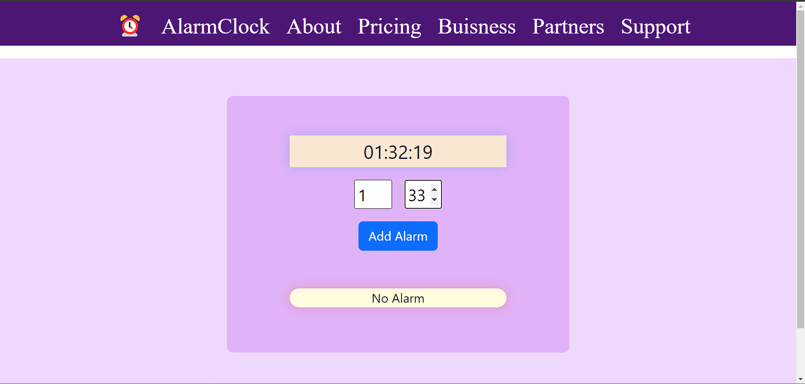

# Alarm Clock⏰

## Description

This is a simple Alarm Clock web application built using HTML, CSS, and JavaScript. The main features include setting alarms, stopping alarms, and deleting alarms.

## Demo

## Usage

1. Open the `index.html` file in your web browser.

2. Set Alarms:
   - Click on the "Set Alarm" button.
   - Enter the time for your alarm.
   - Click "Save" to set the alarm.

3. Stop Alarms:
   - When the alarm goes off, click on the "Stop" button to silence the alarm.

4. Delete Alarms:
   - To remove an alarm, click on the "Delete" button next to the alarm.

## Contributing

Contributions are welcome! Feel free to open issues and submit pull requests to help enhance this project.🤝😁
